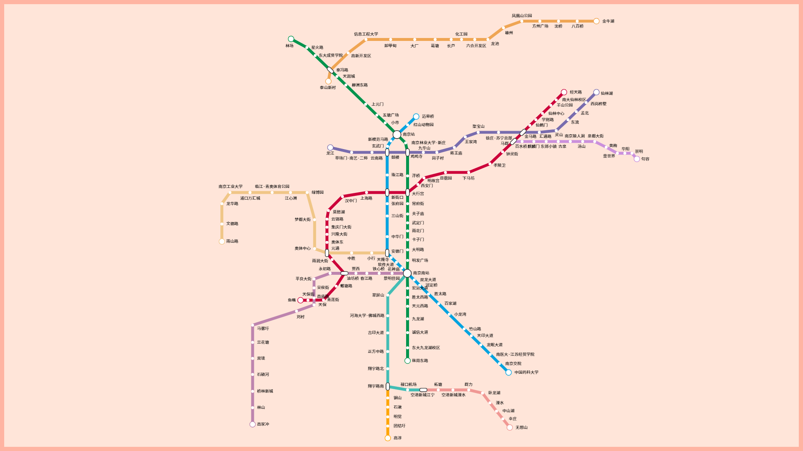

# 南京地铁线路图

Canvas 实现南京地铁线路图，效果如下：

本来选择好 zdog、zrender 等做个小程序的，但是小程序获取不到标准 DOM，不兼容就很尴尬。自己又不想从头写，不想丸辣。所以这个项目刚诞生就被我掐掉了，重新准备其他项目练手小程序吧！

但找到的库还是想使用一下，于是分别用 zdog 和 zrender 在 web 端写了一遍，发现 zdog 竟然不支持文字，加上 zfont 插件和一个巨大的 ttf 字体文件才能使用。zrender 则支持文字。

由于 vite build 打包报错，现只能在 dev 模式下查看，两个页面分别为 `/metro-zdong` 和 `/metro-zrender`

嗯，还有就是文字重叠的问题，这重叠都没法判定，也就不好写一个能覆盖这么多特例的重叠位置重计算的方法了，现在就是写死在数据中了。
